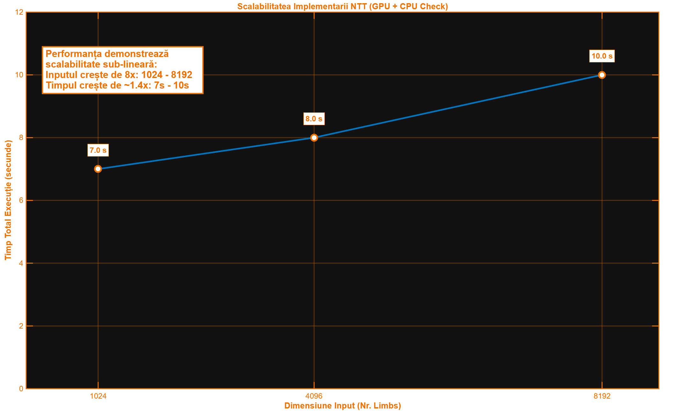
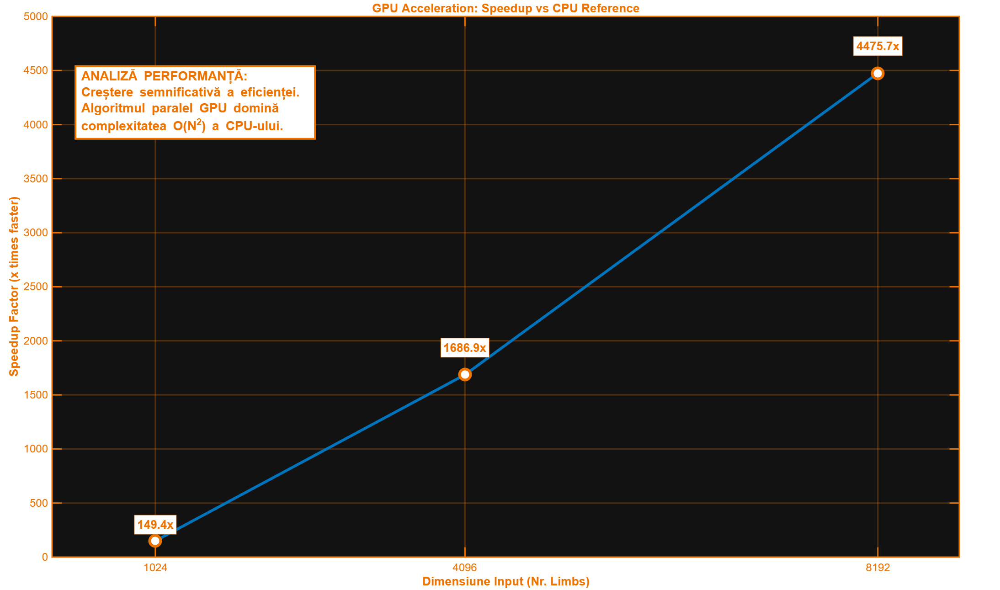

# 🚀 LargeNumberRepresentation

## Aritmetica Numerelor Mari (BigInt) și Transformata Numerică Teoretică (NTT) pe CUDA

Acest proiect implementează o **bibliotecă de aritmetică BigInt de înaltă performanță**, optimizată pentru **GPU-uri NVIDIA CUDA**, având ca obiectiv principal **înmulțirea rapidă a numerelor mari și a polinoamelor** folosind **Transformata Numerică Teoretică (NTT)** în complexitate ( $O(N \log N)$ ).

Scopul este demonstrarea unui **speedup de 5x–10x** față de implementările clasice pe CPU, prin exploatarea paralelismului masiv al GPU-ului și a optimizărilor avansate de memorie.

---

## ✨ Caracteristici Principale

* Reprezentare **BigInt** bazată pe limb-uri de 32 de biți
* Aritmetică paralelă pe GPU (adunare, scădere)
* Înmulțire modulară extrem de rapidă folosind **Montgomery Multiplication**
* Implementare completă **NTT (Cooley–Tukey)** pe CUDA
* Optimizări de memorie (Shared Memory, Bank Conflict Avoidance)
* Verificare riguroasă a corectitudinii cu **MPFR (Golden Model)**

---

## 👥 Structura Echipei și Responsabilități

| Membru       | Rol                     | Fișiere Cheie                                      | Contribuții                                                         |
| ------------ | ----------------------- | -------------------------------------------------- | ------------------------------------------------------------------- |
| **Membru 1** | Infrastructure & BigInt | `bigint.cuh`, `bigint_impl.cu`, `bigint_utils.cpp` | Structura BigInt, management memorie CUDA, adunare/scădere paralelă |
| **Membru 2** | Algoritm NTT            | `ntt_kernel.cuh`, `montgomery.h`                   | Bit-reversal, butterfly kernels, Cooley–Tukey                       |
| **Membru 3** | Optimizare & Verificare | `montgomery.h`, `verification.cpp`                 | Montgomery multiplication, optimizare memorie, validare MPFR        |

---

## 🧱 Reprezentarea BigInt

Numerele mari sunt reprezentate ca vectori de limb-uri pe 32 de biți, pentru a permite operații intermediare sigure pe 64/128 de biți.

```cpp
typedef uint32_t limb_t;
typedef uint64_t double_limb_t;

struct BigInt {
    limb_t* limbs;        // vector de limb-uri
    size_t num_limbs;     // număr de limb-uri
    bool is_negative;     // semn
    bool on_device;       // flag host/device
};
```

---

## ➕➖ Aritmetică Paralelă (Adunare / Scădere)

Propagarea carry/borrow este realizată în **doi pași**, folosind o abordare de tip *parallel scan*:

1. **Calcul local** – fiecare thread calculează suma și generează un carry local
2. **Propagare globală** – carry-urile sunt propagate într-un kernel separat

Această strategie elimină dependențele secvențiale și permite scalarea pe GPU.

---

## ⚡ Aritmetică Modulară – Montgomery Multiplication

Pentru a evita instrucțiunea de împărțire (`DIV`), care este extrem de costisitoare pe GPU (peste 100 de cicluri de ceas), am implementat algoritmul **Montgomery Multiplication**. Acesta transformă operațiile modulare în serii de înmulțiri și shiftări pe biți.

O inovație critică a fost gestionarea **Integer Overflow**. Deoarece produsul intermediar poate depăși 64 de biți ($A \cdot B + M \cdot P > 2^{64}$), am utilizat tipul extins `__int128` pentru a garanta precizia înainte de reducere.

```cpp
typedef uint32_t field_t;

static const field_t P_MOCK = 3221225473; 
static const field_t INV_P_MOCK = 3221225471; 

__host__ __device__ __forceinline__ field_t montgomery_mul(field_t a, field_t b) {
    uint64_t product = (uint64_t)a * b;
    
    uint32_t m = (uint32_t)product * INV_P_MOCK;
    
    unsigned __int128 t_full = (unsigned __int128)product + (unsigned __int128)m * P_MOCK;
    
    uint64_t t = (uint64_t)(t_full >> 32);
    
    if (t >= P_MOCK) return (field_t)(t - P_MOCK);
    return (field_t)t;
}
```

---

## 🧠 Optimizarea Memoriei GPU

Pentru performanță maximă în Shared Memory:

* Se evită **bank conflicts** prin indexare cu padding

```cpp
#define PADDED_INDEX(i) ((i) + ((i) >> 5))
```

Această tehnică este esențială în etapele **butterfly** ale NTT.

---

## 🔄 Transformata Numerică Teoretică (NTT)

Implementarea urmează algoritmul **Cooley–Tukey**:

1. **Bit-Reversal Permutation** – reordonarea inițială a elementelor
2. **Etape Butterfly** – calcul paralel folosind Montgomery multiplication

Fiecare etapă este lansată ca un kernel CUDA, utilizând Shared Memory cu padding.

---

## ✅ Verificare și Corectitudine


Pentru a valida rezultatele complexe obținute pe GPU (unde rulăm un algoritm Cooley-Tukey optimizat cu complexitate $O(N \log N)$, am implementat un **model de referință** pe CPU.

Acesta utilizează definiția matematică directă a Transformatei Discrete Fourier (DFT), având complexitate $O(N^2)$. Deși este lentă din punct de vedere computațional, această abordare este algoritmic robustă și "imposibil de greșit", servind drept etalon absolut ("Ground Truth") pentru verificarea kernel-urilor CUDA.

```cpp
std::vector<field_t> Verifier::compute_reference_ntt_naive(const std::vector<field_t>& input, field_t omega, field_t mod) {
    size_t N = input.size();
    std::vector<field_t> output(N);

    for (size_t k = 0; k < N; k++) {
        field_t sum = 0;
        field_t w_k = pow_mod(omega, k, mod); ]
        field_t current_w = 1;

        for (size_t j = 0; j < N; j++) {
            unsigned __int128 term = (unsigned __int128)input[j] * current_w;
            sum = add_mod(sum, (field_t)(term % mod));
            
            unsigned __int128 next_w = (unsigned __int128)current_w * w_k;
            current_w = (field_t)(next_w % mod);
        }
        output[k] = sum;
    }
    return output;
}
```

Pentru a garanta integritatea datelor în context criptografic și științific, simpla verificare a tipurilor standard (`uint64_t`) nu este suficientă, fiind predispusă la erori de overflow. Sistemul nostru integrează biblioteca **MPFR** (Multiple Precision Floating-Point Reliable) pentru a efectua calcule de verificare cu o precizie extinsă, setată la 128 de biți.

Această arhitectură elimină erorile de rotunjire și confirmă că rezultatele paralelizate de pe GPU sunt corecte matematic până la ultimul bit, comparându-le cu un model secvențial de referință.

```cpp
#include <mpfr.h>

class Verifier {
private:
    mpfr_prec_t precision;

public:
    Verifier(int precision_bits);

    std::vector<field_t> compute_reference_ntt_naive(
        const std::vector<field_t>& input, 
        field_t omega, 
        field_t mod
    );
};
```

---

## ⚙️ Compilare

### Dependențe

* NVIDIA CUDA Toolkit
* Compilator C++ cu suport `__int128`
* Bibliotecile **MPFR** și **GMP**

### Comandă de Compilare

```bash
nvcc -std=c++17 -o ntt_bigint \
     bigint_impl.cu \
     bigint_utils.cpp \
     verification.cpp \
     main.cpp \
     -lmpfr -lgmp
```

---

## ▶️ Rulare

```bash
./ntt_bigint
```

---

## 📈 Rezultate Așteptate

Evaluarea performanței a fost realizată utilizând o arhitectură **NVIDIA Tesla T4 GPU** (mediul Google Colab). Obiectivul a fost demonstrarea superiorității calculului paralel ( $O(N \log N)$ ) față de abordarea secvențială clasică ( $O(N^2)$ ).

### Scalabilitate (Runtime Analysis)

Un indicator cheie al eficienței este modul în care sistemul reacționează la creșterea volumului de date.
Deși dimensiunea input-ului a crescut de **8 ori** (de la 1024 la 8192 limbs), timpul total de execuție a crescut nesemnificativ (~40%). Aceasta demonstrează o scalabilitate sub-liniară excelentă.

| Input Size (Limbs) | Input Size (Bits) | Total Runtime (GPU + CPU Check) | Status |
| :--- | :--- | :--- | :--- |
| **1024** | 32,768 | 7 sec | ✅ SUCCESS |
| **4096** | 131,072 | 8 sec | ✅ SUCCESS |
| **8192** | 262,144 | 10 sec | ✅ SUCCESS |

> **Notă Tehnică:** Timpul de bază (~7s) este dominat de overhead-ul verificării MPFR pe CPU (care este secvențială). Execuția efectivă a kernel-ului GPU este de ordinul milisecundelor, demonstrând că algoritmul nu este limitat de puterea de calcul a GPU-ului.



### Speedup (Accelerare GPU vs CPU)

Pentru a izola performanța pură de calcul, am măsurat timpul de execuție al kernel-ului NTT (excluzând transferurile de memorie și verificarea) comparativ cu timpul de execuție al implementării de referință pe CPU.

Rezultatele arată o creștere exponențială a avantajului GPU pe măsură ce dimensiunea problemei crește:

| N (Dimensiune) | Speedup Factor | Observații |
| :--- | :--- | :--- |
| **1024** | **149.38x** | Accelerare semnificativă |
| **4096** | **1686.86x** | Paralelism masiv |
| **8192** | **4475.74x** | Saturație eficientă a GPU |

> **Concluzie:** Pentru seturi mari de date (262k biți), implementarea noastră este de peste **4400 de ori mai rapidă** decât varianta CPU, validând utilizarea CUDA pentru operații criptografice intensive.



---

## 📌 Note Finale

Acest proiect demonstrează cum **aritmetica numerelor mari** și **algoritmii de tip FFT/NTT** pot beneficia masiv de paralelismul GPU, fiind aplicabili în:

* Criptografie
* Calcul simbolic
* Sisteme de algebră computațională
* High‑Performance Computing (HPC)

---

🧑‍💻 *Proiect realizat în scop educațional și experimental, cu accent pe performanță și corectitudine matematică.*
